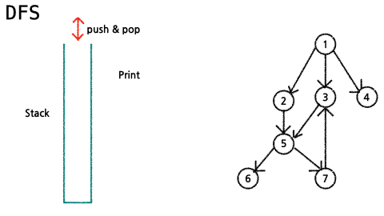
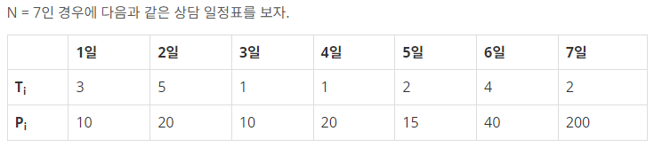
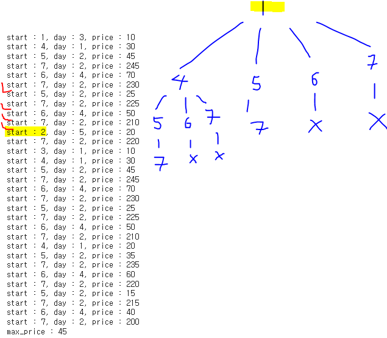

##  DFS(깊이 우선 탐색)

<p align="center">
 </center> <br>
</p>

#### | pseudo code
```python
visited[], stack[]
DFS(v)
  # 시작점 v 방문;
  visited[v] = True
  while {
    if (v의 인접 정점 중 방문 안 한 정점 w가 있으면) :
      push(v);
      stack.apped(w) # w에 방문)
      visited[w] = True
    else :
      if (스택이 비어있지 않으면) :
        v = stack.pop
      else :
        break
  }
```

#### | 재귀
```python
def recursive_dfs(vertex, visited=[]):
    visited.append(vertex) # 첫 Node(vertex)를 방문 처리
    for adj_v in graph[vertex]: # 현재 Node의 하위 노드들에 대해
    	if adj_v not in visited: # 방문 처리되지 않았다면
        	visited = recursive_dfs(adj_v, visited) # 하위 노드에 대해 방문 처리함을 반복한다.
    return visited
```


#### | 반복
```python
def iterative_dfs(start_vertex):
    visited = [start_vertex] # 시작 노드를 방문 처리
    stack = [start_vertex] # Stack을 쌓아나가며 탐색
    
    while stack: # Stack을 모두 탐색할 때까지
    	v = stack.pop() # Stack의 첫 노드
        
        if v not in visited: # 하위 노드를 반복하기 전에 첫 하위노드가 방문 처리되었는지 확인
            visited.append(v) # 방문 처리
            for adj_v in graph[v]: # 추후 탐색해야 할 Stack에 하위 노드들을 삽입
            	stack.append(adj_v)
    return visited
```


[참고사이트]
- [dfs코드](https://statistics-and-data.tistory.com/entry/%EC%9E%90%EB%A3%8C%EA%B5%AC%EC%A1%B0-%EA%B7%B8%EB%9E%98%ED%94%84-DFSBFS-Python-pseudo%EC%BD%94%EB%93%9C%EB%A1%9C-%EC%9D%B4%ED%95%B4%ED%95%98%EA%B8%B0)
-  [dfs gif](https://velog.io/@himinhee/%EC%95%8C%EA%B3%A0%EB%A6%AC%EC%A6%98-DFS%EA%B9%8A%EC%9D%B4-%EC%9A%B0%EC%84%A0-%ED%83%90%EC%83%89-BFS%EB%84%88%EB%B9%84-%EC%9A%B0%EC%84%A0-%ED%83%90%EC%83%89)
---

### | [boj14501](https://www.acmicpc.net/problem/14501)
<p align="center">
 </center> <br>
</p>

<p align="center">
 </center> <br>
</p>

```python
def dfs(start, day, price):
  global max_price

  ## 종료조건
  if start+day > N+1 :
    return # 조건에 맞지 않으면 새로운 price 값 반영 전에 중단
  max_price = max(max_price, price)

  for i in range(start+day, N+1): # 1일 > 4일 / 1일 > 5일 ...
    dfs(i, lst[i][0], price+lst[i][1])

N = int(input()) 
lst = [[0,0]] + [list(map(int, input().split())) for _ in range(N)]

max_price = 0
for i in range(1, N+1):
    dfs(i, lst[i][0], lst[i][1])
print(max_price)
```