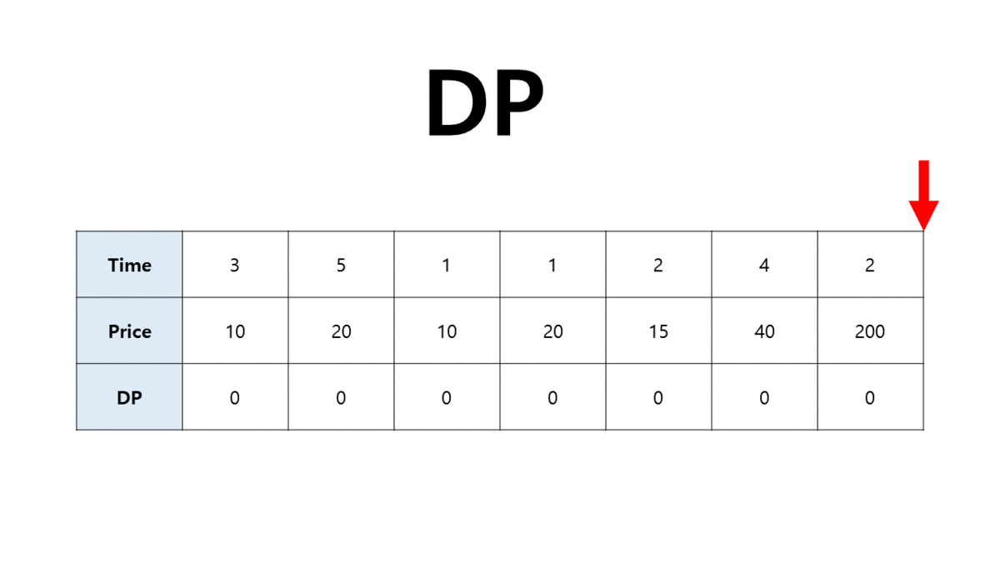

##  DP(Dynamic Prigramming)

<p align="center">
 </center> <br>
</p>

#### | pseudo code
```python
def 
```


[참고사이트]
- [dfs코드](https://statistics-and-data.tistory.com/entry/%EC%9E%90%EB%A3%8C%EA%B5%AC%EC%A1%B0-%EA%B7%B8%EB%9E%98%ED%94%84-DFSBFS-Python-pseudo%EC%BD%94%EB%93%9C%EB%A1%9C-%EC%9D%B4%ED%95%B4%ED%95%98%EA%B8%B0)
-  [dp gif](https://jrc-park.tistory.com/119)
---

### | [boj14501](https://www.acmicpc.net/problem/14501)


```python
n = int(input())
T, P = [0 for i in range(n+1)], [0 for i in range(n+1)]
for i in range(n):
    a,b = map(int, input().split())
    T[i] = a
    P[i] = b

# dp[i]는 i번째날까지 일을 했을 때, 최대값이다. 
dp =[0 for i in range(n+1)]

for i in range(len(T)-2, -1, -1):      # 역순으로 진행
    if T[i]+i <= n:       # 날짜를 초과하지 않을 경우.
        dp[i] = max(P[i] + dp[i + T[i]], dp[i+1])   
    else:                 # 날짜를 초과할 경우.
        dp[i] = dp[i+1]
print(dp[0])
출처: https://jrc-park.tistory.com/119 [Rudi:티스토리]
```