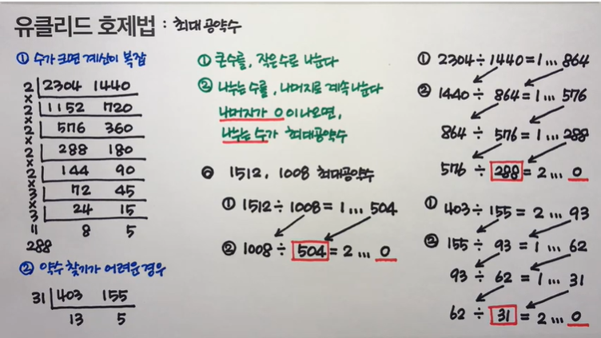

## 최대공약수와 최소공배수

### | 유클리드 호제법

 
  

#### ① 큰 수를 작은 수로 나눈다.
#### ② 나누는 수를 나머지로 계속 나눈다.
#### &ensp; → 나머지가 0이 나오면, 나누는 수가 `최대공약수`
#### &ensp; → 두 수를 곱하고, 최대공약수로 나눠준 값이 `최소공배수`가 됨

[참고문제]
* [boj1934](https://www.acmicpc.net/problem/1934)
* [boj2609](https://www.acmicpc.net/problem/2609)
* [boj13241](https://www.acmicpc.net/problem/13241)
