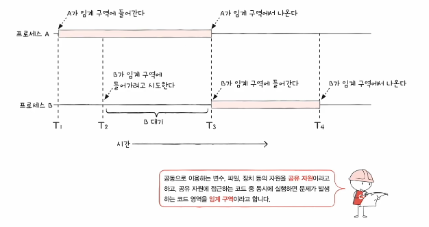
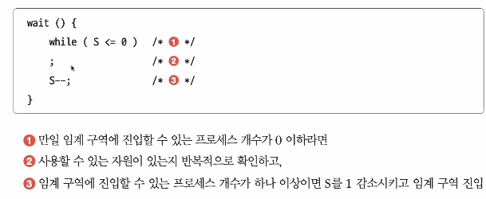
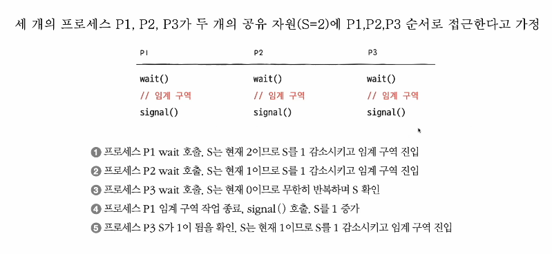
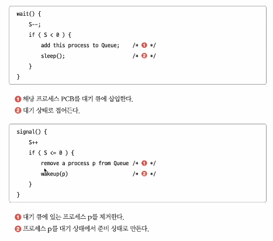

# 동기화
## | 들어가며
* 동시다발적으로 실행되는 프로세스들은 서로 협력하며 영향을 주고 받는다.
* 이 과정에서 자원의 일관성을 보장해야 한다.

 

## | 동기화의 의미
* 공동의 목적을 위해 동시에 수행되는 프로세스는 올바른 수행을 위해 프로세스들은 동기화되어야 한다.
* ex) 워드 프로세서 프로그램
  * 맞춤법 검사 프로세서
  * 입력 내용을 화면에 출력하는 프로세스 
* 동기화 : 프로세스들이 수행 시기를 맞추는 것
  
  `실행 순서 제어` : 프로세스를 올바른 순서대로 실행하기

  `상호 배제` : 동시에 접그내서는 안 되는 자원에 하나의 프로세스만 접근하게 하기

 

### ■ 실행 순서 제어를 위한 동기화
* Writer : Book.txt파일에 값을 저장하는 프로세스
* Reader : Book.txt파일에 저장된 값을 읽어들이는 프로세스
* Reader와 Writer 프로세스는 무작정 아무렇게나 실행되어선 안된다. `실행의 순서`가 있기 때문
* Reader 프로세스는 'Book.txt'안에 값이 존재한다는 특정 조건이 만족되어야만 실행 가능

### ■ 상호 배제를 위한 동기화
* 공유가 불가능한 자원의 동시 사용을 피하기 위한 동기화
* 한 번에 하나의 프로세스만 접근해야 하는 자원에 동시 접근을 피하기 위한 동기화

####  공유 자원와 임계 구역
* 공유 자원 : 여러 프로세스 혹은 스레드가 공유하는 자원(전역 변수, 파일, 입출력장치,보조기억장치...)
* 임계 구역 : 동시에 실행하면 문제가 발생하는 자원에 접근하는 코드 영역. 임계 구역에 진입하고자 하면 진입한 프로세스 이외에는 대기해야 한다.
* 임계 구역에 동시에 접근하면 자원의 일관성이 깨질 수 있다. 이를 `레이스 컨디션`이라고 한다.(고급언어가 저급언어로 변환되어 실행되며 일관성이 깨질 수 있음)

 

 

#### 운영체제가 임계구역 문제를 해결하는 세 가지 원칙(상호 배제를 위한 동기화를 위한 세 가지 원칙)
1. 상호 배제(mutual exclusion)
   * 한 프로세스가 임계 구역에 진입했다면 다른 프로세스는 들어올 수 없다.
2. 진행 (progress)
   * 임계 구역에 어떤 프로세스도 진입하지 않았다면 진입하고자 하는 프로세스는 들어갈 수 있어야 한다.
3. 유한 대기(bounded waiting)
   * 한 프로세스가 임계 구역에 진입하고 싶다면 언젠가는 임계 구역에 들어올 수 있어야 한다.(임계 구역에 들어오기 위해 무한정 대기해서는 안 된다.)

 

## | 동기화 기법

### ■ 뮤테스 락
* 상호 배제를 위한 동기화 도구(자물쇠 역할)
* 뮤텍스 락은 하나의 전역변수와 두개의 함수로 구현

  ① 자물쇠 역할 : 프로세스들이 공유하는 전역변수 lock

  ② 임계구역을 잠그는 역할: acquire함수

  - 프로세스가 임계 구역 진입 전에 호출하는 함수. 
  - 임계 구역이 잠겨있다면 열릴때까지 무한히 반복적으로 확인(`busy waiting`)
  - 임계 구역이 열려있다면 임계구역을 잠그는(1)의 lock변수를 true로 바꾸는 함수

  ③ 임계구역의 잠금 해제 역할: release함수

  - 임계 구역에서의 작업이 끝나고 호출하는 함수 
  - 잠긴 임계구역을 열어주는(1)의 lock변수를 false로 바꾸는 함수

- lock을 획득하지 못하면 무작정 대기, lock을 획득할 수 있다면 임계구역을 잠근 뒤 작업 진행, 빠져나올 때 임계 구역 잠금 해제의 과정을 통해 상호배제 동기화 방식으로 임계구역을 보호한다.

 

### ■ 세마포
* 좀 더 일반화된 방식의 동기화 도구
* 공유 자원이 여러 개 있는 경우에도 적용 가능
* 세마포도 뮤텍스락처럼 하나의 변수와 두개의 함수로 구현

  ① 임계 구역에 진입할 수 있는 프로세스의 개수(사용가능한 공유자원의 개수)를 나타내는 전역 변수 S

  ② 임계구역에 들어가도 좋을지 기다려야 할지를 알려주는 wait함수 - `busy waiting`

  ③ 임계구역 앞에서 기다리는 프로세스에 가도 좋다고 신호를 보내는 signal 함수

 

 

`busy waiting`
* 마치 탈의실 문이 열렸는지/닫혔는지 반복적으로 확인하는 것과 같다 → CPU 사이클 낭비
* 해결방법
  * 사용할 수 있는 자원이 없을 경우 대기 상태로 만듦(해당 프로세스의 PCB를 대기 큐에 삽입)
  * 사용할 수 있는 지원이 생겼을 경우 대기 큐의 프로세스를 준비 상태로 만듦(해당 프로세스의 PCB를 대기 큐에서 꺼내 준비 큐에 삽입)

 

* 세마포를 활용한 실행 순서 동기화
  * 세마포의 변수 S를 0으로 두고,
  * 먼저 실행할 프로세스 뒤에 signal함수,
  * 다음에 실행할 프로세스 앞에 wait함수를 붙이면 됩니다.
  
 

### ■ 모니터
* 세마포 동기화 방법에서 매번 임계 구역에 앞뒤로 일일이 wait와 signal함수를 붙이는것은 번거롭고, 순서를 헷갈려 잘못 된 코드를 기재할 경우 예기치 못한 오류가 발생할 수 있다. 이러한 이유로 세마포가 발전된 형태인 모니터 기법이 나옴.
* 사용자가 다루기에 편한 동기화 도구

◎ 상호 배제를 위한 동기화
* 인터페이스를 위한 큐
* 공유자원에 접근하고자 하는 프로세스를 큐에 삽입
* 큐에 삽입된 순서대로 (한 번에 하나의 프로세스만) 공유 자원 이용
  
◎ 실행 순서 제어를 위한 동기화
* 조건 변수 이용
* 프로세스나 스레드의 실행 순서를 제어하기 위해 사용하는 특별한 변수
  * 조건변수.wait() : 대기 상태로 변경, 조건 변수에 대한 큐에 삽입
  * 조건변수.signal() : wait()으로 대기 상태로 접어든 조건변수를 실행 상태로 변경
  * 특정 프로세스가 아직 실행될 조건이 되지 않았을 때는 wait를 통해 실행을 중단
  * 특정 프로세스가 실행될 조건이 충족되었을 때는 signal을 통해 실행을 재개

[혼자 공부하는 CS git hub](https://github.com/kangtegong/self-learning-cs)