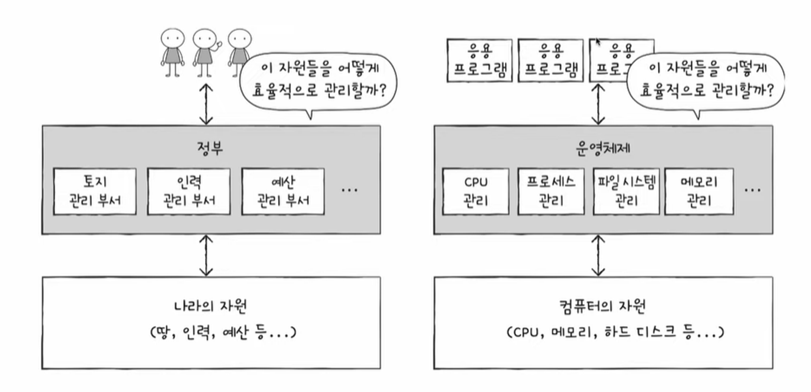
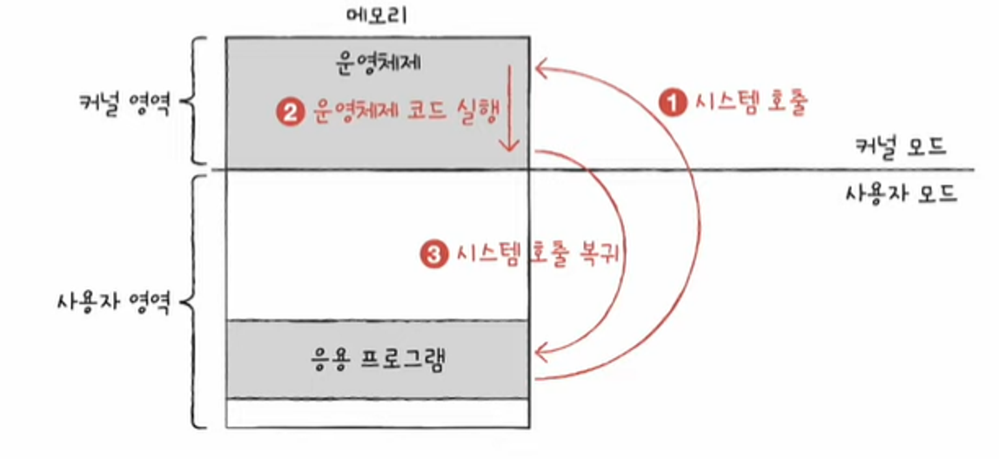
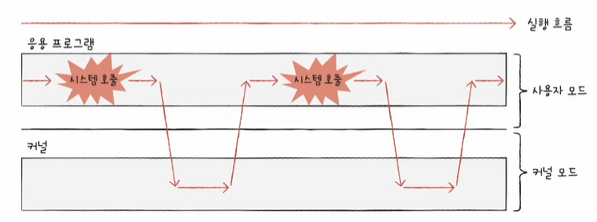

# 운영체제
## | 기본 용어 

### ■ (시스템)자원
* 프로그램 실행에 있어 마땅히 필요한 요소
* 컴퓨터의 네 가지 핵심 부품 포함하며 하드웨어만을 자원이라고 부르지 않음.
* 모든 프로그램은 실행을 위해 자원을 필요로 함. 

### ■ 메모리
* 실행되고 있는 프로그램은 모두 메모리에 저장됨.
* 메모리는 크게 커널영역과 사용자 영역으로 구분됨. 커널영역에는 `운영체제` 프로그램이, 사용자 영역에는 `응용프로그램`이 적재됨. 이때 응용 프로그램은 사용자가 특정 목적을 위해 사용하는 일반적인 프로그램을 의미함.

 

## | 운영체제
* 컴퓨터 부품들을 실질적으로 동작시켜주는 프로그램  
예시) windows, android, macOS, Linux 등
* 실행할 프로그램에 필요한 자원을 할당하고, 프로그램이 올바르게 실행되도록 돕는 특별한 프로그램
* 운영체제가 있기에 하드웨어를 조작하는 코드를 직접 작성할 필요가 없어짐.

 

 
  

  

## | 운영체제가 하는 일
 

`메모리 관리`   
- 운영체제는 응용 프로그램을 적재해서 실행
- 프로그램 실행 중단 시 메모리에서 삭제   

`CPU관리`  
- 응용 프로그램의 실행 순서와 시간을 결정함.   

`입출력장치`  
- 다수의 프로그램이 동일한 입출력장치에 접근할 때 동시 접근을 방지

 

🍀**운영체제를 알아야하는 이유**
> 운영체제는 사용자를 위한 프로그램이 아닌 `프로그램`을 위한 프로그램이다. 그렇기에 프로그램을 만드는 개발자는 운영체제를 알아야한다. 

 

## | 운영체제의 서비스
* 운영체제는 현존하는 프로그램 중 규모가 가장 큰 프로그램 중 하나로, 운영체제가 제공하는 기능은 다양함. 그 중에서도 가장 핵심적인 서비스는 `커널`임.

### ■ 커널
* 운영체제의 핵심 서비스를 담당하는 부분
* 운영체제에는 속하나 커널에는 속하지 않는 기능 : 유저 인터페이스 등

### ■ 이중모드
* 응용 프로그램이 자원에 접근하려면 운영체제의 코드를 실행해야 함. 이러한 운영체제의 문지기 모드를 `이중모드`라고 함.
* 이중모드는 CPU가 명령어를 실행하는 모드를 **사용자 모드**와 **커널 모드**로 구분하는 방식임.

 

`사용자 모드`
  * 운영체제 서비스를 제공받을 수 없는 실행 모드 
  * 커널 영역의 코드를 실행할 수 없는 실행 모드
  * 자원 접근 불가

 

`커널 모드`
  * 운영체제의 서비스를 제공받을 수 있는 실행모드
  * 자원 접근을 비롯한 모든 명령어 실행 가능

### ■ 시스템 호출
* 운영체제 서비스를 제공받기 위해 이중 모드의 `커널 모드로 전환`하는 방법
* 일종의 소프트웨어 인터럽트 : 시스템이 호출 처리되는 방식은 하드웨어 인터럽트 처리 방식과 유사

 

 
 
 

 

## | 운영체제의 핵심 서비스
### ■ 프로세스 관리
* 프로세스 == 실행 중인 프로그램
* 동시다발적으로 생성/실행/삭제되는 다양한 프로세스를 일목요연하게 관리
(CPU가 빠르게 처리해서 동시에 실행하는 것처럼 보임)

### ■ 자원 접근 및 할당
* CPU : CPU 스케쥴링(어떤 프로세스를 먼저, 얼마나 오래 실행할지 결정)
* 메모리 : 프로그램 적재 및 삭제(페이징, 스와핑 등)
* 입출력장치 : 응용 프로그램이 입출력장치에 접근하고자 할 때 운영체제는 인터럽트 서비스 루틴을 제공

### ■ 파일 시스템 관리
* 관련된 정보(보조기억장치 속 데이터)를 파일이라는 단위로 저장 장치에 보관
* 파일들을 묶어 폴더(디렉터리) 단위로 저장 장치에 보관
