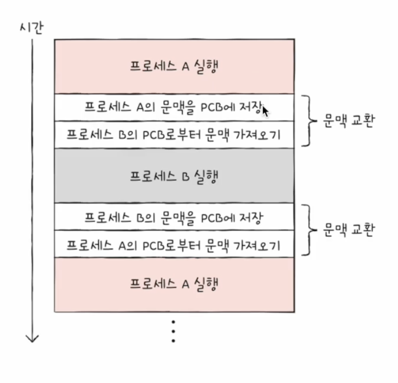
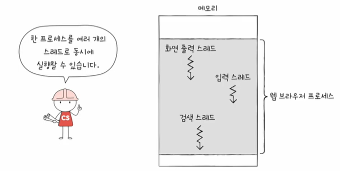

# 프로세스
## | 프로세스 개요
* 프로세스 = 실행 중인 프로그램
* 보조기억 장치에 있는 프로그램을 메모리에 적재하고 실행하는 순간 해당 프로그램은 프로세스라고 함.
* 모든 프로세스는 실행을 위해 CPU가 필요함.

 

`포그라운드 프로세스` 
* 사용자가 볼 수 있는 공간에서 실행되는 프로세스

`백그라운드 프로세스` 
* 사용자가 볼 수 없는 공간에서 실행되는 프로세스
* 사용자와 직접 상호작용이 가능한 프로세스와 사용자와 상호작용하지 않고 그저 정해진 일만 수행하는 프로세스(데몬, 서비스)로 나뉨

 

## | 프로세스 제어 블록(PCB)
* 제한된 CPU를 효율적으로 이용하기 위해 프로세스들은 돌아가면 한정된 시간 만큼만 CPU 이용
  * 자신의 차례에 정해진 시간만큼 CPU이용
  * 타이머 인터럽트가 발생하면 차례 양보
* 운영체제는 이처럼 빠르게 번갈아 수행되는 프로세스들을 관리
* 이때 사용하는 자료구조가 프로세스 제어 블록(PCB)
  * 프로세스 관련 정보를 저장하는 자료 구조
  * 마치 상품에 달린 태그와 같은 정보
  * 프로세스 생성 시 커널 영역에 생성, 종료 시 폐기

### ■ PCB에 담기는 대표적인 정보
* 프로세스 ID (=PID)
  * 특정 프로세스를 식별하기 위해 부여하는 고유한 번호
* 레지스터 값
  * 프로세스는 자신의 실행 차례가 오면 이전까지 사용한 레지스터 중간 값을 모두 복원 → 실행 재개
  * 프로그램 카운터, 스택 포인터, ...
* 프로세스 상태
  * 입출력 장치를 사용하기 위해 기다리는 상태
  * CPU를 사용하기 위해 기다리는 상태
  * CPU를 이용 중인 상태, ...
* CPU 스케줄링 정보
  * 프로세스가 언제, 어떤 순서로 CPU를 할당받을지에 대한 정보
* 메모리 정보
  * 프로세스가 어느 주소에 저장되어 있는지에 대한 정보
  * 페이지 테이블 정보(메모리 주소를 알 수 있는 정보가 담김)
* 사용한 파일과 입출력장치 정보
  * 할당된 입출력장치, 사용 중인(열린) 파일 정보

 

## | 문맥 교환 (context switch)
* 한 프로세스(e.g. 프로세스 A)에서 다른 프로세스(e.g. 프로세스 B)로 실행 순서가 넘어가면?
* 기존에 실행되던 프로세스 A는 지금까지의 **중간 정보**를 백업
  * 프로그램 카운터 등 각종 레지스터 값, 메모리 정보, 열었던 파일, 사용한 입출력 장치 등
  * 이러한 중간 정보 == `문맥 (context)`
  * **실행 문맥을 백업해두면 언제든 해당 프로세스의 실행을 재개할 수 있음**
* 뒤이어 실행할 프로세스 B의 문맥을 복구
* 자연스럽게 실행 중인 프로세스가 바뀜

 
  

* 기존의 실행 중인 프로세스 문맥을 백업하고 새로운 프로세스 실행을 위해 문맥을 복구하는 과정을 `문맥 교환 (context switch)`이라 함

 

## | 프로세스의 메모리 영역
* 코드 영역(= 텍스트 영역), 데이터 영역, 힙 영역, 스택 영역

 
  

`코드 영역`
* 실행할 수 있는 코드, 기계어로 이루어진 명령어 저장
* 데이터가 아닌 CPU가 실행할 명령어가 담기기에 쓰기가 금지된 영역 (read-only)
* 정적 할당 영역 (크기 고정)

`데이터 영역`
* 잠깐 썼다가 없앨 데이터가 아닌 프로그램이 실행되는 동안 유지할 데이터 저장
* 전역 변수
* 정적 할당 영역 (크기 고정)

`힙 영역`
* 프로그램을 만드는 사용자, 즉 프로그래머가 직접 할당할 수 있는 저장 공간
* 참고. 가비지 컬렉션
  * 힙 영역 메모리 할당 후 프로그래밍 언어가 자동으로 반환
  * 그렇지 않을 경우 메모리 누수(Memory leak) 발생
* 동적 할당 영역 (크기 가변)
  * 일반적으로 힙 영역은 낮은 주소 → 높은 주소로 할당

`스택 영역`
* 데이터가 **일시적**으로 저장되는 공간
* (데이터 영역에 담기는 값과는 달리) 잠깐 쓰다가 말 값들이 저장되는 공간
* 매개 변수, 지역 변수
* 동적 할당 영역 (크기 가변)
  * 일반적으로 스택 영역은 높은 주소 → 낮은 주소로 할당
  * `힙 영역`과 반대 방향으로 메모리 주소를 유지하며 충돌을 피함.

 

## | 프로세스 상태

 
  

`생성 상태 (new state)`
* 이제 막 메모리에 적재되어 PCB를 할당 받은 상태
* 준비가 완료되었다면 준비 상태로

`준비 상태 (ready state)`
* 당장이라도 CPU를 할당받아 실행할 수 있지만 자신의 차례가 아니기 때문에 기다리는 상태
* 자신의 차례가 된다면 실행 상태로 (=디스패치)

`실행 상태 (running state)`
* CPU를 할당 받아 실행 중인 상태
* 할당된 시간 모두 사용 시(타이머 인터럽트 발생 시) 준비 상태로
* 실행 도중 입출력장치를 사용하면 입출력 작업이 끝날 때까지 대기 상태로

`대기 상태 (blocked state)`
* 프로세스가 실행 도중 입출력장치를 사용하는 경우
* 입출력 작업은 CPU에 비해 느리기에 이 경우 대기 상태로 접어듦
* 입출력 작업이 끝나면 (입출력 완료 인터럽트를 받으면) 준비 상태로

`종료 상태 (terminated state)`
* 프로세스가 종료된 상태
* PCB, 프로세스의 메모리 영역 정리

 

## | 프로세스 계층

 
  

* 프로세스 실행 도중 (시스템 호출을 통해) 다른 프로세스 생성 가능
* 새 프로세스를 생성한 프로세스 = 부모 프로세스
* 부모 프로세스에 의해 생성된 프로세스 = 자식 프로세스
  * 부모 프로세스와 자식 프로세스는 별개의 프로세스이므로 각기 다른 PID를 가짐
  * 일부 운영체제에서는 자식 프로세스 PCB에 부모 프로세스 PID(PPID) 명시하기도
  * 자식 프로세스는 또 다른 자식 프로세스를 낳을 수 있음 → 계층 구조 형성
* 최초의 프로세스 확인: pstree (리눅스, macOS)

 

## | 프로세스 생성 기법

 
  

* 부모 프로세스는 자식 프로세스를 어떻게 만들어 내고, 자식 프로세스는 어떻게 자신만의 코드를 실행할까?

### ■ 복제와 옷 갈아입기
* 부모 프로세스는 `fork 시스템 호출`을 통해 자신의 복사본을 자식  프로세스로 생성(복제)
  * 복사본 (=자식 프로세스) 생성
  * 부모 프로세스의 자원 상속
  * PID, 저장되어 있는 메모리의 위치 등은 다름 (별개의 프로세스이기 때문에)
* 자식 프로세스는 `exec 시스템 호출`을 통해 자신의 메모리 공간을 다른 프로그램으로 교체(옷 갈아입기)
  * 메모리 공간을 새로운 프로그램으로 덮어쓰기
  * 코드/데이터 영역은 실행할 프로그램 내용으로 바뀌고 나머지 영역은 초기화

 

## | 스레드 

 
  

* 프로세스를 구성하는 **실행 흐름의 단위**
* 실행 흐름이 하나인 프로세스 = 단일 스레드 프로세스
* 실행 흐름이 여러 개인 프로세스 = 멀티 스레드 프로세스
  * 프로세스를 이루는 여러 명령어 동시 실행 가능
  
 

## | 스레드의 구성 요소

 
  

* 하나의 스레드 마다 `스레드 ID, 프로그램 카운터를 비롯한 레지스터 값, 스택` 등 실행에 필요한 최소한의 정보를 가지고 있음
* 프로세스를 이루는 스레드들은 프로세스의 자원을 공유하면서 실행됨

 

## | 멀티 프로세스와 멀티 스레드

 
  

* 멀티 프로세스와 멀티 스레드의 차이점
  * 프로세스끼리는 자원을 공유X, 스레드끼리는 자원을 공유

### ■ 멀티 프로세스

 
  

* 동일한 작업을 수행하는 단일 스레드 프로세스 여러 개 실행
  * 프로세스끼리는 자원을 공유하지 않음 (독립적으로 실행)
  * (참고) 프로세스 간에도 자원을 주고 받는 방법 = 프로세스 간 통신 (IPC)
    * 파일을 통한 프로세스 간 통신, 공유 메모리를 통한 프로세스 간 통신 ...
* 프로세스를 fork하면 코드/데이터/힙 영역 등 모든 자원이 복제되어 저장됨
  * 저장된 메모리 주소를 제외하면 모든 것이 동일한 프로세스 두 개가 통째로 메모리에 적재
  * fork를 세번, 네번하면 메모리에는 같은 프로세스가 통째로 세개, 네개  적재
* (참고) fork 직후 같은 프로세스를 통째로 메모리에 중복 저장하지 않으면서 동시에 프로세스끼리 자원을 공유하지 않는 방법도 있는데, 이를 `쓰기 시 복사(copy on write)` 기법이라고 함

### ■ 멀티 스레드

 
  

* 하나의 프로세스를 여러 스레드로 실행
* 스레드들은 각기 다른 스레드 ID, (별도의 실행을 위해 꼭 필요한) 프로그램 카운터 값을 포함한 레지스터 값, 스택을 가질 뿐 **프로세스가 가지는 자원을 공유** 
→ 협력과 통신에 유리, 때로는 문제가 될 수 있음